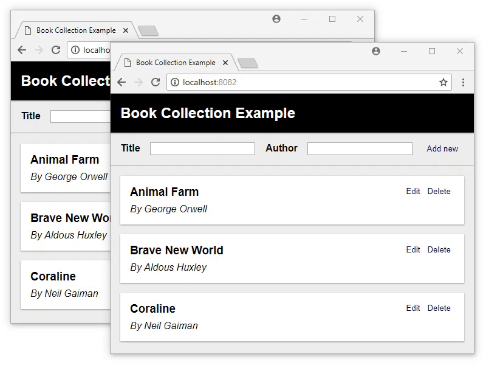
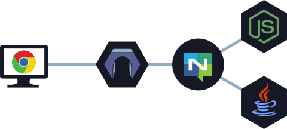

<p align="center"><a href="https://resgate.io" target="_blank" rel="noopener noreferrer"></a></p>


<h2 align="center"><b>Realtime API Gateway</b><br/>Synchronize Your Clients</h2>
</p>

<p align="center">
<a href="http://opensource.org/licenses/MIT"></a>
<a href="http://goreportcard.com/report/resgateio/resgate"></a>
<a href="https://travis-ci.com/resgateio/resgate"></a>
<a href="https://coveralls.io/github/resgateio/resgate?branch=master"></a>
</p>

<p align="center">Visit <a href="https://resgate.io">Resgate.io</a> for <a href="https://resgate.io/docs/get-started/introduction/">guides</a>, <a href="https://resgate.io/demo/">live demos</a>, and <a href="https://resgate.io/docs/get-started/resources/">resources</a>.</p>

---

Resgate is a [Go](http://golang.org) project implementing a realtime API gateway for the [RES protocol](docs/res-protocol.md) with [NATS server](https://nats.io/about/) as messaging system.

It is a simple server that lets you create REST, real time, and RPC APIs, where all your clients are synchronized seamlessly.

Used for building **new REST APIs** with real-time functionality, or when creating **single page applications** using reactive frameworks such as React, Vue.js, or Modapp.

  
*Screen capture from the [Book Collection Example](examples/book-collection/). Try out the [Live demo](https://resgate.io/demo/#book-collection-demo) version yourself.*

## How it works

Resgate handles all API requests from your clients, instead of directly exposing your micro-services (represented by *Node.js* and *Java* below). Clients will connect to Resgate, using either HTTP or WebSocket, to make requests. These requests are sent to the micro-services over NATS server, and Resgate will keep track on which resource each client has requested.

Whenever there is a change to the data, the responsible micro-service sends an event. Resgate will use this event to both update its own cache, and make sure each subscribing client is kept up-to-date.

<p align="center"></p>

## Quickstart

If you <a href="https://docs.docker.com/install/" target="_blank">install Docker</a>, it is easy to run both *NATS server* and *Resgate* as containers:

```text
docker network create res
docker run -d --name nats -p 4222:4222 --net res nats
docker run --name resgate -p 8080:8080 --net res resgateio/resgate --nats nats://nats:4222
```

Both images are small, about 10 MB each.

See [Resgate.io - Installation](https://resgate.io/docs/get-started/installation/) for other ways of installation.

## Examples

While Resgate may be used with any language, the examples in this repository are written in Javascript for Node.js, without using any additional library.

* For Go (golang) examples, see [go-res package](https://github.com/jirenius/go-res)
* For C# (NETCore) examples, see [RES Service for .NET](https://github.com/jirenius/csharp-res)

| Example | Description
| --- | ---
| [Hello World](examples/hello-world/) | Simple service serving a static message.
| [Edit Text](examples/edit-text/) | Text field that can be edited by multiple clients concurrently.
| [Book Collection](examples/book-collection/) | List of book titles & authors that can be edited by many.
| [JWT Authentication](examples/jwt-authentication/) |Showing how JWT tokens can be used for authentication.
| [Password Authentication](examples/password-authentication/) | Showing authentication with user and password credentials.
| [Client Session](examples/client-session/) | Creating client sessions that survive reloads and reconnects.

> **Note**
>
> All examples are complete with both service and client.

## Protocol Specification

For more in depth information on the protocol:

* [RES protocol](docs/res-protocol.md) - Introduction and general terminology
* [RES-Service protocol](docs/res-service-protocol.md) - How to write services
* [RES-Client protocol](docs/res-client-protocol.md) - How to write client libraries, if [ResClient](https://github.com/resgateio/resclient) doesn't fit your needs

## Usage
```
resgate [options]
```

### Server options

| Option | Description | Default value
| --- | --- | ---
| `-n`, `--nats <url>` | NATS Server URL | `nats://127.0.0.1:4222`
| `-i`, `--addr <host>` | Bind to HOST address | `0.0.0.0`
| `-p`, `--port <port>` | HTTP port for client connections | `8080`
| `-w`, `--wspath <path>` | WebSocket path for clients | `/`
| `-a`, `--apipath <path>` | Web resource path for clients | `/api/`
| `-r`, `--reqtimeout <seconds>` | Timeout duration for NATS requests | `3000`
| `-u`, `--headauth <method>` | Resource method for header authentication |
| `    --tls` | Enable TLS for HTTP | `false`
| `    --tlscert <file>` | HTTP server certificate file |
| `    --tlskey <file>` | Private key for HTTP server certificate |
| `    --apiencoding <type>` | Encoding for web resources: json, jsonflat | `json`
| `    --creds <file>` | NATS User Credentials file |
| `    --alloworigin <origin>` | Allowed origin(s): *, or \<scheme\>://\<hostname\>\[:\<port\>\] | `*`
| `    --putmethod <methodName>` | Call method name mapped to HTTP PUT requests |
| `    --deletemethod <methodName>` | Call method name mapped to HTTP DELETE requests |
| `    --patchmethod <methodName>` | Call method name mapped to HTTP PATCH requests |
| `-c`, `--config <file>` | Configuration file in JSON format |

### Logging options

| Option | Description
| --- | ---
| `-D`, `--debug` | Enable debugging output
| `-V`, `--trace` | Enable trace logging
| `-DV` | Debug and trace

### Common options

| Option | Description
| --- | ---
| `-h`, `--help` | Show usage message
| `-v`, `--version` | Show version


## Configuration
Configuration is a JSON encoded file. If no config file is found at the given path, a new file will be created with default values as follows.

### Properties

```javascript
{
    // URL to the NATS server.
    "natsUrl": "nats://127.0.0.1:4222",
    // NATS User Credentials file path.
    // Eg. "ngs.creds"
    "natsCreds": null,
    // Timeout in milliseconds for NATS requests
    "requestTimeout": 3000,
    // Bind to HOST IPv4 or IPv6 address.
    // Empty string ("") means all IPv4 and IPv6 addresses.
    // Invalid or missing IP address defaults to 0.0.0.0.
    "addr": "0.0.0.0",
    // Port for the http server to listen on.
    // If the port value is missing or 0, standard http(s) port is used.
    "port": 8080,
    // Path for accessing the RES API WebSocket.
    "wsPath": "/",
    // Path prefix for accessing web resources.
    "apiPath": "/api",
    // Encoding for web resources.
    // Available encodings are:
    // * json - JSON encoding with resource reference meta data.
    // * jsonflat - JSON encoding without resource reference meta data.
    "apiEncoding": "json",
    // Flag enabling WebSocket per message compression (RFC 7692).
    "wsCompression": false,
    // Call method name to map HTTP PUT method requests to.
    // Eg. "put"
    "putMethod": null,
    // Call method name to map HTTP DELETE method requests to.
    // Eg. "delete"
    "deleteMethod": null,
    // Call method name to map HTTP PATCH method requests to.
    // Eg. "patch"
    "patchMethod": null,
    // Header authentication resource method for web resources.
    // Prior to accessing the resource, this resource method will be
    // called, allowing an auth service to set a token using
    // information such as the request headers.
    // Missing value or null will disable header authentication.
    // Eg. "authService.headerLogin"
    "headerAuth": null,
    // Flag enabling tls encryption.
    "tls": false,
    // Certificate file path for tls encryption.
    "tlsCert": "",
    // Key file path for tls encryption.
    "tlsKey": "",
    // Allowed origin for CORS requests, or * to allow all origins.
    // Multiple origins are separated by semicolon.
    // Eg. "https://example.com;https://api.example.com"
    "allowOrigin": "*",
    // Flag enabling debug logging.
    "debug": false,
    // Flag enabling trace logging.
    "trace": false
}
```

## Running Resgate

By design, Resgate will exit if it fails to connect to the NATS server, or if it loses the connection.
This is to allow clients to try to reconnect to another Resgate instance and resume from there, and to give Resgate a fresh new start if something went wrong.

A simple bash script can keep it running:

```bash
#!/bin/bash
until ./resgate; do
    echo "Resgate exited with code $?.  Restarting.." >&2
    sleep 2
done
```

## Documentation

Visit [Resgate.io](https://resgate.io) for documentation and resources.

It has guides on [installation](https://resgate.io/docs/get-started/installation/), [configuration](https://resgate.io/docs/get-started/configuration/), [writing services](https://resgate.io/docs/writing-services/01hello-world/), [scaling](https://resgate.io/docs/advanced-topics/scaling/), [queries](https://resgate.io/docs/advanced-topics/query-resources/), and other useful things. It also contains guides for [ResClient](https://resgate.io/docs/writing-clients/resclient/) when working with frameworks such as [React](https://resgate.io/docs/writing-clients/using-react/), [Vue.js](https://resgate.io/docs/writing-clients/using-vuejs/), and [Modapp](https://resgate.io/docs/writing-clients/using-modapp/).

## Support Resgate

Resgate is an MIT-licensed open source project where development is made possible through community support.

If you'd like help out, please consider:

- [Make a one-time donation via PayPal](https://paypal.me/jirenius)
- [Become a backer via GitHub Sponsors](https://github.com/sponsors/jirenius)


## Contribution

Any feedback on the protocol and its implementation is highly appreciated!

If you find any issues with the protocol or the gateway, feel free to [report them](https://github.com/resgateio/resgate/issues/new).

If you have created a service library, a client library, or some other tool or utility, please contact me to have it added to [the list of resources](https://resgate.io/docs/get-started/resources/).
