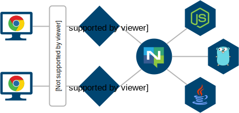

# Resgate - A Realtime + REST API gateway

[![License][License-Image]][License-Url]
[![ReportCard][ReportCard-Image]][ReportCard-Url]

A [Go](http://golang.org) project implementing a Realtime API gateway for the [RES protocol](docs/res-protocol.md) with [NATS server](https://nats.io/about/) as messaging system.

Used for building *scalable*, *resilient*, *extensible*, and *secure* client web APIs based on *simple*, *stateless* micro-services serving *realtime* resources to web applications.

Simple, stateless, and scalable like REST, but updated in real-time.

  
*Screen capture from the [Book Collection Example](examples/book-collection/)*.

## Features

**Realtime data**  
All resources subscribed by the clients are updated in realtime. The gateways will keep track on what resources are currently being subscribed by any of its connected clients, making sure their data is kept up-to-date.

**Stateless**  
No client context is held by the services between requests. Each request contains all the information necessary to service the request.

**Scalable**  
Multiple gateways may be connecteded to the same messaging system to handle large amounts of clients. Multiple clusters of messaging systems, gateways, and services, may be used for further scaling.

**Resilient**  
The system can recover from lost connections, service failures, or gateway failures. The client will be updated as soon as the system is back online.

**Access control**  
Resource access can be handled using access tokens. Tokens may at any time be revoked or replaced. If a token is revoked/replaced, all subscriptions will be paused for reauthorization with the new token, and resources which no longer are authorized will be unsubscribed without delay.

**Secure**  
The client uses WebSockets as transport layer, allowing for TLS/SSL encryption. Access tokens for access control are stored on the gateway and not in the client, protecting against token theft.

**Hot-adding**  
Services can be added or removed to the API without any disruption or configuration changes. Simply just connect/disconnect the service to the messaging system.

**Caching**  
All resources are cachable by the gateway, taking load off the services. The gateway keeps its cache up-to-date using the events emitted from the services.

**Resource queries**  
The protocol supports resource queries where partial or filtered resources are requested, such as for searches, filters, or pagination. Just like any other resource, query resources are also updated in realtime.

**Web resources**  
All resources may be accessed using ordinary web (http) requests, in a RESTful manner. The same goes for all resource method calls.

**Language agnostic**  
Services may be written in any language [supported by the messaging system](https://nats.io/download/).

**Simple**  
The protocol uses simple JSON messages and is easy to implement.

## Quickstart

If you just want to see what Resgate can do, and you have:
* [installed Go](https://golang.org/doc/install) and [set your `$GOPATH`](https://golang.org/cmd/go/#hdr-GOPATH_environment_variable)
* added `$GOPATH/bin` (where your binaries ends up) to your `PATH`
* [installed node.js](https://nodejs.org/en/download/) (for the test app)

Install and run [NATS server](https://nats.io/download/nats-io/gnatsd/) and Resgate:
```bash
go get github.com/nats-io/gnatsd
gnatsd
```
```bash
go get github.com/jirenius/resgate
resgate
```

Run one of the examples:
* [Hello World example](examples/hello-world/)
* [Book Collection example](examples/book-collection/)

Or install and run [Resgate Test App](https://github.com/jirenius/resgate-test-app):
```bash
git clone https://github.com/jirenius/resgate-test-app
cd resgate-test-app
npm install
npm run start
```

Open your favorite browser and go to:
```
http://localhost:8000/
```

## Documentation

For more in depth information on the protocol:

* [RES protocol](docs/res-protocol.md) - Entry point to get all the details
* [RES-Service protocol](docs/res-service-protocol.md) - How to write services
* [RES-Client protocol](docs/res-client-protocol.md) - How to write client libraries, if [ResClient](https://github.com/jirenius/resclient) doesn't fit your needs

## Architecture

There are many possible setups. Below is an example setup consisting of three micro-services and two resgates with a load balancer.



For additional scaling and high availability, the setup may be replicated and distributed geographically as long as each service has a way of synchronizing with the same services in other replicas.

## Services
Because of the simplicity of the [RES-Service protocol](docs/res-service-protocol.md), a single-threaded service can be created without the need of a library, as with the [resgate-test-app](https://github.com/jirenius/resgate-test-app).

For writing multi-threaded services in Go:

* Go - https://github.com/jirenius/go-res

*Have you written a service library? Send a link to have it added to the README.*

## Clients
* Javascript - https://github.com/jirenius/resclient

*Have you written a client library? Send a link to have it added to the README.*
## Usage
```
resgate [options]
```
| Option | Description |
|---|---|
| `-n, --nats <url>` | NATS Server URL |
| `-p, --port <port>` | Use port for clients |
| `-w, --wspath <path>` | Path to websocket |
| `-a, --apipath <path>` | Path to webresources |
| `-r, --reqtimeout <seconds>` | Timeout duration for NATS requests |
| `-u, --headauth <method>` | Resource method for header authentication |
| `    --tls` | Enable TLS |
| `    --tlscert <file>` | Server certificate file |
| `    --tlskey <file>` | Private key for server certificate |
| `-c, --config <file>` | Configuration file |
| `-h, --help` | Show usage message |


## Configuration
Configuration is a JSON encoded file. If no config file is found at the given path, a new file will be created with default values as follows.

### Properties

```javascript
{
	// URL to the NATS server
	"natsUrl": "nats://127.0.0.1:4222",
	// Timeout in seconds for NATS requests
	"requestTimeout": 5,
	// Port for the http server to listen on.
	// If the port value is missing or 0, standard http(s) port is used.
	"port": 8080,
	// Path for accessing the RES API websocket
	"wsPath": "/",
	// Path for accessing web resources
	"apiPath": "/api",
	// Header authentication resource method for web resources.
	// Prior to accessing the resource, this resource method will be
	// called, allowing an auth service to set a token using
	// information such as the request headers.
	// Missing value or null will disable header authentication.
	// Eg. "authService.headerLogin"
	"headerAuth": null,
	// Flag telling if tls encryption is enabled
	"tls": false,
	// Certificate file path for tls encryption
	"tlsCert": "",
	// Key file path for tls encryption
	"tlsKey": ""
}
```

## Running resgate

By design, resgate will exit if it fails to connect to the NATS server, or if it loses the connection.
This is to allow clients to try to reconnect to another resgate instance and resume from there, and to give resgate a fresh new start if something went wrong.

A simple bash script can keep it running:

```bash
#!/bin/bash
until ./resgate; do
    echo "resgate exited with code $?.  Restarting.." >&2
    sleep 2
done
```

## Contributing

The RES protocol and resgate is still under development, and is currently at a state where the protocol has settled, but the gateway has yet to be properly tested.

While it may be used in non-critical environments, it is not yet recommended to use the gateway for any critical systems. Any feedback on the protocol and its implementation is highly appreciated!

If you find any issues with the protocol or the gateway, feel free to [report them](https://github.com/jirenius/resgate/issues/new) as an Issue.

[License-Url]: http://opensource.org/licenses/MIT
[License-Image]: https://img.shields.io/badge/License-MIT-blue.svg
[ReportCard-Url]: http://goreportcard.com/report/jirenius/resgate
[ReportCard-Image]: http://goreportcard.com/badge/github.com/jirenius/resgate