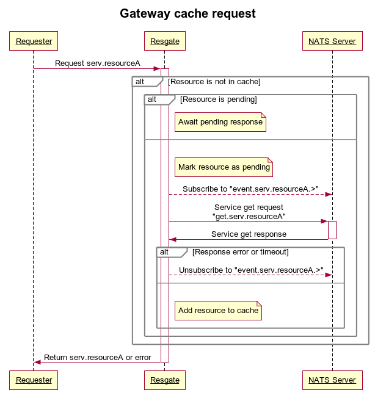
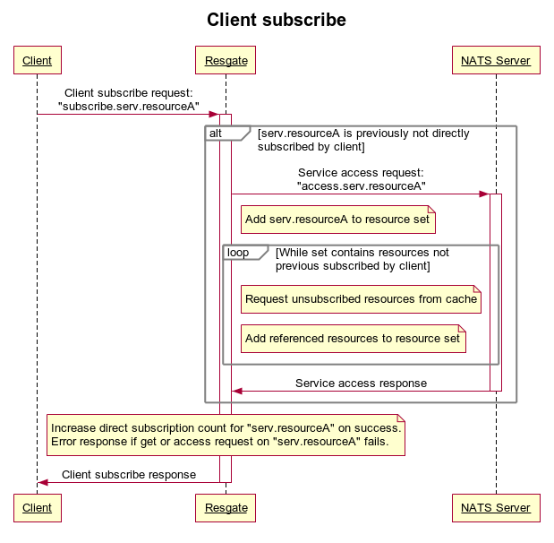
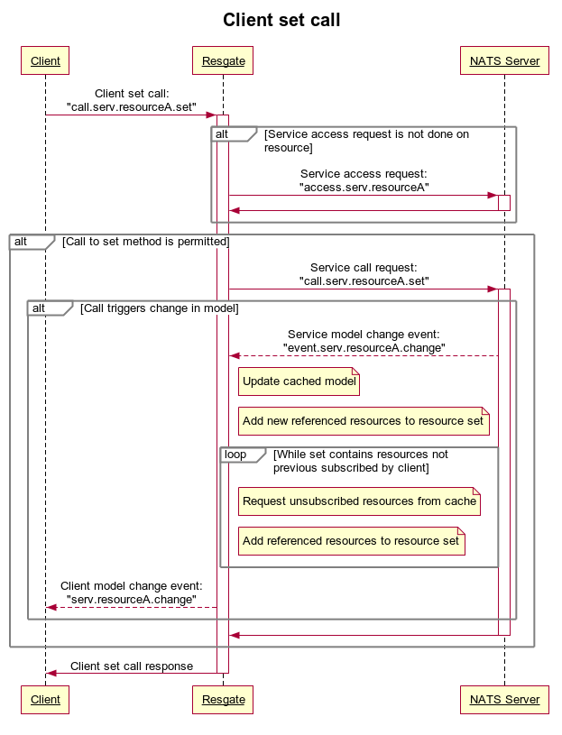

# Resgate data flow

# Introduction

This document gives an overview of how data flows through the resgate.

## Conventions
This document uses the definition of [resource](res-protocol.md#resources), [model](res-protocol.md#models), [collection](res-protocol.md#collections), [value](res-protocol.md#values), [service](res-protocol.md#services), [client](res-protocol.md#clients), and [gateway](res-protocol.md#gateways) as described in the [RES Protocol Specification](res-protocol.md).

References to requests and events described in the [RES-Service Protocol Specification](res-service-protocol.md) will be prefixed with the word *service*, such as [*service get request*](res-service-protocol.md#get-request), [*service model change event*](res-service-protocol.md#model-change-event), or [*service reaccess event*](res-service-protocol.md#reaccess-event).

References to requests and events described in the [RES-Client Protocol Specification](res-client-protocol.md) will be prefixed with the word *client*, such as [*client subscribe request*](res-client-protocol.md#subscribe-request), [*client model change event*](res-client-protocol.md#model-change-event), or [*client custom event*](res-client-protocol.md#custom-event).

Dotted lines in the sequence diagrams refers to a [NATS subscription/unsubscription](https://nats.io/documentation/concepts/nats-pub-sub/) made on a subject.

## Cache request

When a resource is requested, as a result of a client request or service event, the gateway will attempt to fetch if from the cache, or populate the cache on a miss.



<!-- ```sequence
title Gateway cache request

participant Requester as req
participant Resgate as resgate
participant NATS Server as nats

req->+resgate: Request serv.resourceA
alt Resource is not in cache
    alt Resource is pending
        note right of resgate: Await pending response
    else
        note right of resgate: Mark resource as pending
        resgate--\>nats: Subscribe to "event.serv.resourceA.>"
        resgate->+nats: Service get request\n"get.serv.resourceA"
        nats->-resgate: Service get response
        alt Response error or timeout
            resgate--\>nats: Unsubscribe to "event.serv.resourceA.>"
        else
            note right of resgate: Add resource to cache
        end
    end
end
resgate->-req: Return serv.resourceA or error
```
-->

### Notes
* Any *service resource event*, except `reaccess` events, receive prior to the *Service get response* will be discarded.
* `reaccess` events will be handled after the cache request is completed

## Client subscribe



### Notes
* Response to the *Service access request* is not synchronized with cache resource requests.

<!--
```sequence
title Client subscribe

participant Client as client
participant Resgate as resgate
participant NATS Server as nats

client->+resgate: Client subscribe request:\n"subscribe.serv.resourceA"

alt serv.resourceA is previously not directly subscribed by client
    resgate->+nats: Service access request:\n"access.serv.resourceA"
    note right of resgate: Add serv.resourceA to resource set
    loop While set contains resources not previous subscribed by client
        note right of resgate: Request unsubscribed resources from cache
        note right of resgate: Add referenced resources to resource set
    end
    nats->-resgate: Service access response
end


note over resgate: Increase direct subscription count for "serv.resourceA" on success.\nError response if get or access request on "serv.resourceA" fails.
resgate->-client: Client subscribe response
```
-->

## Client set call

Below diagrams shows a resource change event triggered by a call to the *set* method.



<!--
```res
title Client set call

participant Client as client
participant Resgate as resgate
participant NATS Server as nats

client->+resgate: Client set call:\n"call.serv.resourceA.set"

alt Service access request is not done on resource
    resgate->+nats: Service access request:\n"access.serv.resourceA"
    nats->-resgate:
end

alt Call to set method is permitted
    resgate->+nats: Service call request:\n"call.serv.resourceA.set"
    alt Call triggers change in model
        nats--\>resgate: Service model change event:\n"event.serv.resourceA.change"
        note right of resgate: Update cached model
        note right of resgate: Add new referenced resources to resource set
        loop While set contains resources not previous subscribed by client
        note right of resgate: Request unsubscribed resources from cache
        note right of resgate: Add referenced resources to resource set
    end
        resgate--\>client: Client model change event:\n"serv.resourceA.change"
    end
    nats->-resgate:
end

resgate->-client: Client set call response

```
-->

### Notes
* *Client subscribe request* results in error if:
  * Access request fails
  * Access is not permitted
  * *Service call request* returns with error
